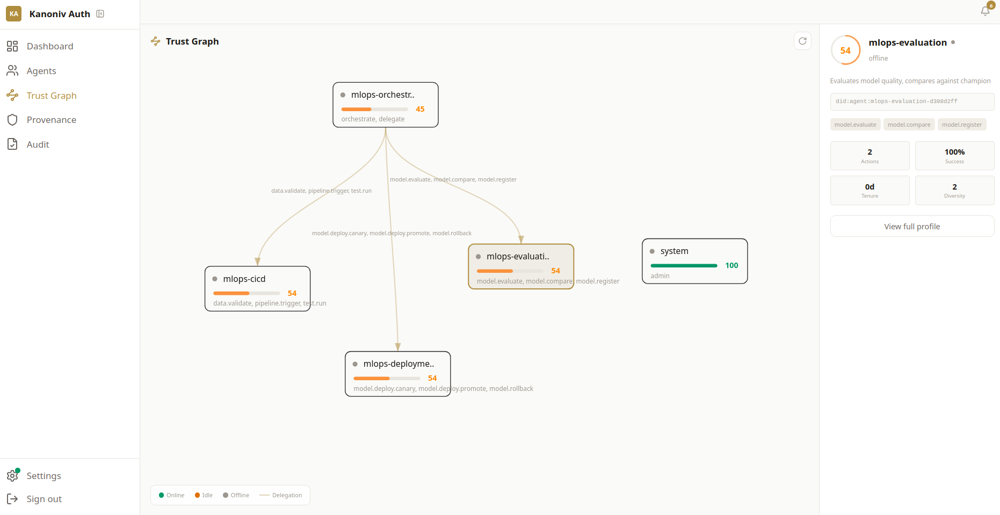

# mlops-agents

Agentic MLOps Orchestration -- AI agents that make decisions, not just execute scripts.

Every model promotion, rollback, and retrain trigger has an auditable chain-of-thought reasoning trace. Agents decide; humans approve strategy.

## Architecture

```
                      Human Operator
                           |
                      Orchestrator
                     (DAG execution)
                           |
       +---------+---------+---------+---------+---------+
       |         |         |         |         |         |
     CI/CD    Eval     Deploy   Monitor   Retrain  Feedback
     Agent    Agent    Agent    Agent     Agent    Agent
       |         |         |         |         |         |
  +----+---------+---------+---------+---------+---------+----+
  |              Provider Abstraction Layer                    |
  +-----------------------------------------------------------+
  |  Local: Docker, MLflow, DuckDB, FastAPI                   |
  |  GCP:   Vertex AI, GCS, BigQuery (+ Cloud Run planned)    |
  +-----------------------------------------------------------+
```

**6 agents**, each owning a decision boundary in the ML lifecycle:

| Agent | Decides |
|---|---|
| **CI/CD** | Is data valid? Schema changes? Distribution drift? Trigger training? |
| **Evaluation** | Champion vs candidate. Fairness. Latency SLA. Go/no-go. |
| **Deployment** | Canary traffic %. Error rate OK? Promote or rollback? |
| **Monitoring** | Real drift or noise? Severity? Retrain trigger? |
| **Retraining** | Full retrain or fine-tune? What data window? |
| **Feedback** | Actionable feedback? Error patterns? Enough for retrain? |

## Quick Start

```bash
# Install (local mode - no cloud required)
pip install mlops-agents

# Ingest a notebook
mlops-agents ingest fraud_model.ipynb

# Run the pipeline
mlops-agents run pipeline/pipeline.yaml

# View the audit trail
mlops-agents audit --trace pipe-abc123

# Check recent pipeline runs
mlops-agents status
```

## Notebook Ingestion

Data scientists work in notebooks. `mlops-agents ingest` converts any notebook into a production pipeline -- `train.py` + `pipeline.yaml` + `requirements.txt`.

Three modes, pick your friction level:

### Manifest (recommended -- zero disruption)

Add one cell at the bottom of your notebook. Don't touch your working code:

```python
# mlops: manifest
# cell 0: imports
# cell 3: data-loading
# cell 5-7: training
# cell 9: evaluation
# cell 10: metrics
```

Supports cell ranges (`cell 5-7`) for multi-cell sections.

```bash
mlops-agents ingest notebook.ipynb

  Manifest cell detected - deterministic extraction
  Model type: random_forest
  Metrics: f1, accuracy, auc_roc

  Generated 3 files in pipeline/
```

### Blueprint tags (inline)

Add a comment to the first line of each relevant cell:

```python
# mlops: training
model = RandomForestClassifier(n_estimators=100)
model.fit(X_train, y_train)
```

Tags: `imports`, `data-loading`, `feature-engineering`, `training`, `evaluation`, `metrics`, `config`

### Inference (zero effort)

No tags at all. The parser infers structure from code patterns with confidence levels:

```bash
mlops-agents ingest messy_notebook.ipynb

  No # mlops: tags found. Inferring structure...
    imports: cells 0,1 (confidence: high)
    training: cells 8-12 (confidence: high)
    metrics: not found

  Missing required sections: metrics
  Add this tag to your notebook:
    # mlops: metrics
```

Honest about what it can and can't detect. The inference mode nudges toward better structure over time.

## Pipeline YAML

```yaml
name: fraud-detection
trigger:
  schedule: "0 2 * * *"

reasoning:
  engine: claude
  model: claude-sonnet-4-20250514

provider:
  backend: local

escalation:
  default_confidence_threshold: 0.7
  per_stage:
    deployment: 0.9

stages:
  validate:
    agent: cicd
    on_success: [train]
    on_failure: [alert_human]

  train:
    agent: retraining
    on_success: [evaluate]

  evaluate:
    agent: evaluation
    on_success: [deploy]
    on_failure: [retrain]
    params:
      min_improvement: 0.005

  deploy:
    agent: deployment
    strategy: canary
    on_success: [monitor]
    on_failure: [rollback]

  monitor:
    agent: monitoring
    mode: continuous
    check_interval: 15m
    on_drift: [retrain]

  retrain:
    agent: retraining
    on_success: [evaluate]
```

## The Audit Trail

Every decision has a reasoning trace -- not just "model deployed" but **why**:

```json
{
  "agent": "evaluation",
  "action": "model.evaluate",
  "approved": true,
  "reasoning": {
    "observations": [
      "Candidate F1: 0.934 vs Champion F1: 0.921 (+1.4%)",
      "Fairness: demographic parity delta 0.02 (OK, threshold: 0.05)",
      "Latency p99: 8ms (SLA: 50ms)"
    ],
    "analysis": "Clear improvement across all metrics. No fairness regression.",
    "conclusion": "Promote candidate to champion.",
    "confidence": 0.92
  }
}
```

With `pip install mlops-agents[claude]`, these traces come from real LLM reasoning -- not templates.

## Observatory (Agent Observability)

Every agent decision is observable via [auth.kanoniv.com](https://auth.kanoniv.com):



*The Trust Graph shows the orchestrator delegating scoped authority to each agent. Each node displays capabilities, reputation score, and online status. Delegation edges show exactly which scopes were granted.*

```bash
pip install mlops-agents[observatory]
export KANONIV_AUTH_KEY=kt_live_...
```

The Observatory provides:
- **Agent registry** -- each agent gets a persistent DID and capabilities
- **Delegation chain** -- orchestrator delegates scoped authority to each agent
- **Provenance timeline** -- every decision signed and timestamped
- **Trust graph** -- visual map of agent relationships
- **Reputation tracking** -- feedback signals build agent reliability scores

Optional. The framework works without it. When enabled, every `pipeline.run()` automatically registers agents, delegates scopes, and logs decisions.

## With GCP

```bash
pip install mlops-agents[gcp]
```

```yaml
provider:
  backend: gcp
  gcp:
    project_id: my-project
    region: us-central1
    staging_bucket: gs://my-mlops-staging
    bigquery_dataset: ml_features
```

## SDK

```python
from mlops_agents import Pipeline

# Run from YAML
pipeline = Pipeline.from_yaml("pipeline.yaml")
trace = await pipeline.run()

# Inspect decisions
for d in trace.decisions:
    print(f"{d.agent_name}: {d.action} -> {'GO' if d.approved else 'NO-GO'}")
    print(f"  {d.reasoning.conclusion}")
```

### Custom Agents

```python
from mlops_agents.core.agent import BaseAgent, AgentContext
from mlops_agents.core.decision import Decision

class MyAgent(BaseAgent):
    name = "custom"
    authority = ["custom.action"]

    async def decide(self, ctx: AgentContext) -> Decision:
        ctx.observe("Custom check passed")
        reasoning = await self.reason(ctx.observations, {}, "custom.action")
        return Decision(
            trace_id=ctx.trace_id,
            agent_name=self.name,
            action="custom.action",
            approved=True,
            reasoning=reasoning,
        )
```

### Notebook Ingestion (programmatic)

```python
from mlops_agents.ingest.parser import analyze_notebook
from mlops_agents.ingest.generator import generate_all

structure = analyze_notebook("notebook.ipynb")
print(f"Mode: {structure.mode}")  # manifest, blueprint, or inferred
print(f"Model: {structure.detected_model_type}")
print(f"Metrics: {structure.detected_metrics}")

files = generate_all(structure, output_dir="pipeline/")
```

## Provider Abstraction

The framework is cloud-agnostic. Six Protocol interfaces, swap backends with one config line:

| Interface | Local (default) | GCP |
|---|---|---|
| ComputeProvider | Subprocess | Vertex AI Training |
| StorageProvider | Filesystem | Google Cloud Storage |
| MLPlatformProvider | Local JSON | Vertex AI Experiments* |
| DataProvider | DuckDB/JSON | BigQuery |
| EventBusProvider | AsyncIO | Cloud Pub/Sub* |
| ServingProvider | In-memory | Cloud Run* |

*Stubbed -- falls back to local. Contributions welcome.

## Infrastructure (GCP)

```bash
cd infra/terraform/gcp
cp terraform.tfvars.example terraform.tfvars
# Edit terraform.tfvars with your project ID
terraform init
terraform apply
```

Creates: GCS bucket, BigQuery datasets, Vertex AI IAM, service account.

## Development

```bash
git clone https://github.com/dreynow/mlops-agents.git
cd mlops-agents
python -m venv .venv && source .venv/bin/activate
pip install -e ".[dev]"
pytest tests/ -v
```

206 tests, <2s.

## License

Apache 2.0
